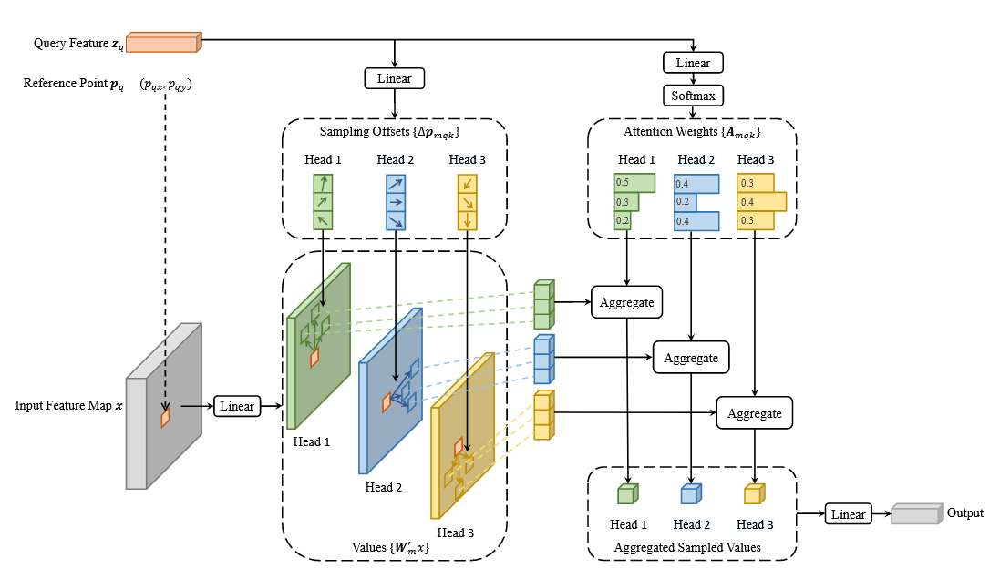

本实验旨在通过实验对比detr、detr-dc、deformable-detr、deformable detr(+iterative bbox refinement)及deformable detr(++two-stage)的性能，加深对模型架构的理解。
## DETR
detr是一种端到端的目标检测方法，无需繁琐的后处理（如nms），也无需事先人工设计proposal，只需backbone抽取特征与Transformer encoder+decoder即可生成预测框及类别。detr为目标检测领域开辟了一条全新的道路，有许多后续工作进行改进并在coco数据集上取得了相当好的成绩。

#### 步骤
1. 将图片输入backbone(res50/res101)得到feature map，并加入2d位置编码（sin）。
2. 将1中结果以像素为单位输入Transformer encoder，进一步学习图片中任务相关物体的信息。encoder学习到了物体的形状，并能初步将物体与其他个体分离（DETR paper Fig.3）。
3. 设置num_query个可学习object query embedding作为decoder的输入，在每层decoder先做self attention再以2中encoder output为key做cross attention（q、k加相应的1d/2d pos embedding，v不加）。
4. 将decoder output送入linear projection+softmax/3-layer mlp分别得到类别预测与预测框的yolo格式坐标。
5. 预测时直接取预测类别与box坐标（可设定置信度筛选）；训练时分别计算类别的CE loss/box的giou loss与使用匈牙利算法得出的最优匹配loss/取所有层输出分别计算前述loss相加得auxiliary loss（可选），取weighted sum得到总loss，再backward。

#### 优点&缺陷
优点：简化了传统目标检测步骤，无需proposal与nms（object query可视为一种自动学习的proposal），相较于此前使用Transformer进行目标检测的方法而言，取得了有竞争力的coco数据集精度。
缺陷：训练收敛慢，需要数百个epoch；仅在大物体上表现好，中小物体上性能有待提高。

## Deformable DETR(simple version)
Deformable DETR通过multi-scale deformable attention在训练慢与小规模物体检测性能差两个问题上做了改进。以下详述改进策略。

#### Multi-scale deformable attention
1.multi-scale
DETR在获取backbone输出时仅获取了最后一层的feature map，没有利用到多尺度信息。deformable attention则从backbone获取了4个不同尺度的特征图（resnet c3/c4/c5, c3+c4+c5输出由1\*1 conv与Transformer hidden size对齐得到各边尺寸为input 1/8, 1/16, 1/32的feature map，c5输出再由3\*3,stride=2 conv获取尺寸为1/64的feature map），送入encoder进行多尺度计算，具体计算过程在2中给出。

2.deformable attention

传统attention模块（self/cross）中单个query需要与全部可能的key计算attention score，而deformable attention提出对于单个query $z_q$ , 在每个head中对每个层次的feature map取n_points（可取3或4）个点作为value，再做weighted sum即可，从而大幅节省了计算时间。attention score与value均由$z_q$ 经过linear projection（score还需加softmax）得到。

在cross attention中，$z_q$ 需要先由初始的object query经过linear projection预测得到reference point（feature map中的某个点，同时也是此query代表的预测框的中心坐标），reference point对应位置的feature map向量即为$z_q$。在不使用iterative bbox refinement技巧时，每个object query对应的reference point在每个forward过程的初始已经确定，在每一层中都不变。下面介绍使用上述技巧，在每一层中不断调整reference point。
## Iterative bbox refinement
不同于simple version，在得到当前layer输出hs后，需将hs输入给参数不与其他层共享的3-layer mlp预测reference point偏移量，加到当前reference point上作为新的预测框中心点。注意每个新的reference point都会用detach方法阻断梯度，从而阻止跨层梯度传播（参考点在各层相当于先验）。

## two-stage+Iterative bbox refinement
为了改进decoder使用的reference point质量，two-stage策略首先将encoder输出的feature map：1) 输入进classifier得到每个point的logits，2) 输入进bbox_predictor，得到预测box的4d偏移（x,y,w,h)，而map上的每个点(x,y)本身对应了一个初始box proposal:(x,y,0.05\*2\*\*level,0.05\*2\*\*level), $level \in \{1,2,3,4\}$ 为feature map所属层级。将proposal与偏移相加得到每个点处的真正box proposal。

而后取第一类分数最高的topk个点对应的box proposal进行保留，记为topk_coords_unact（最后一维有四个分量x,y,w,h），归一化后得到输入进decoder的init reference point。将topk_coords_unact输入进全连接层+layernorm可得输入进decoder的query_embedding与positional_embedding。后续在decoder cross attention进行sampling时，样本点在该层对应的reference point box(x,y,w,h)中取值。

综上，两个策略均为用来提升decoder中object query对应的feature map中reference point的质量而被提出。

## Experiment
本实验在cppe-5数据集上对比DETR、Deformable DETR、Deformable DETR(+iterative bbox refinement)及Deformable DETR(++two-stage)的性能。
### settings
- **CPU Cores**: 16
- **Memory**: 120 GB
- **GPU**: NVIDIA RTX 4090/24GB
- **Number of GPUs**: 1
- **OS/Platform**: Linux
- **Python**: 3.12
- **PyTorch**: 2.3.0+cu121
- **CUDA**: 12.1

### results
下面为用四种方法在cppe-5数据集上训练50 epochs的各项指标。训练参数：lr=1e-4，在epoch=40时调整为1e-5； batch_size=16；weight_decay=1e-4；adamW betas= (0.9,0.999)；adamW epsilon =1e-8.

| Metric Category                                                              | DETR                                         | Deformable DETR                               | Deformable DETR + Iterative BBox Refinement | Deformable DETR ++Two-Stage               |
| ---------------------------------------------------------------------------- | -------------------------------------------- | --------------------------------------------- | ------------------------------------------- | ----------------------------------------- |
| **mAP**                                                                      | 0.232                                        | 0.3052                                        | 0.318                                       | 0.327                                     |
| **mAP_50 mAP_75**                                                         | 0.4721 0.1868                             | 0.558 0.2883                               | 0.573 0.301                              | 0.585 0.315                            |
| **mAP_Coverall mAP_Mask mAP_Gloves mAP_Face_Shield mAP_Goggles** | 0.587 0.2249 0.151 0.1186 0.0784 | 0.6106 0.3401 0.2183 0.1701 0.187 | 0.625 0.352 0.227 0.182 0.195   | 0.638 0.364 0.235 0.195 0.203 |
| **mAP_small mAP_medium mAP_large**                                     | 0.101 0.2005 0.2627                    | 0.1814 0.2784 0.3247                    | 0.193 0.291 0.337                     | 0.205 0.302 0.348                   |
其中mAP_Coverall/Mask/Gloves...为数据集中物体类别对应的类内mAP。

在训练相同轮次下，deformable DETR相较DETR而言mAP提升约0.07，mAP_small提升约0.08，说明MSDeformAttn一定程度上缓解了训练效率慢与小物体检测精度低的问题。Iterative bbox refinement/two-stage方法都在原有基础上带来了小幅提升，说明deformable detr中的仅由linear projection固定decoder reference point的方法会带来精度损失，逐层调整与encoder proposal的方式有效缓解了reference point不准确的问题。

